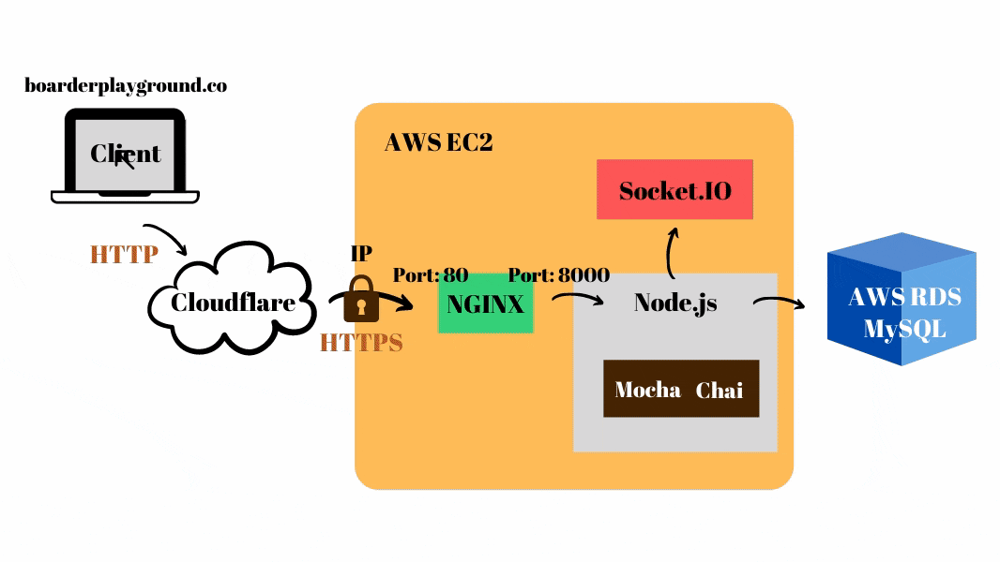
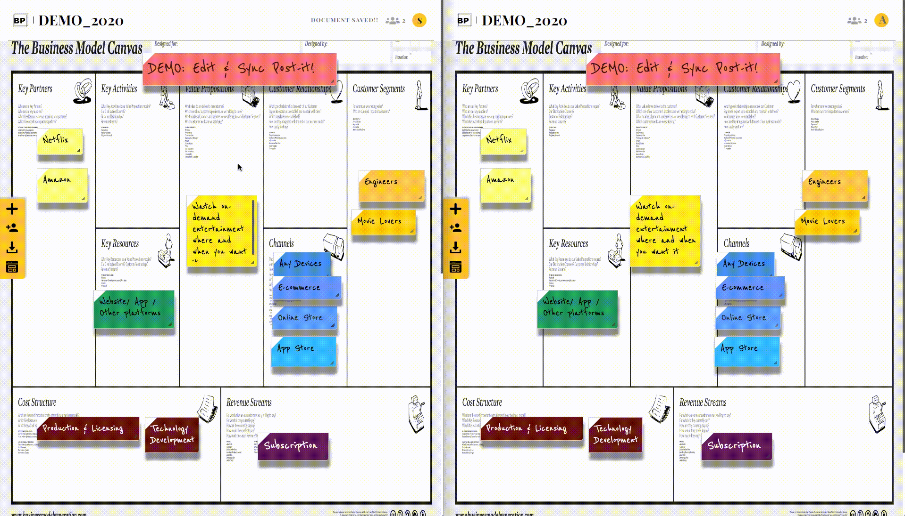

# Boarder-Playground
Website Link: https://boarderplayground.co/

Having a hard time organizing ideas and random thoughts? 
Exploring a wider space for a private workshop? 

BOARDER PLAYGROUND is an online co-work platform allowing users to unleash their creativity and share notes at home, work or on the go.

Whether you're an individual user or accessing BOARDER PLAYGROUND as a team, this platform supports real-time editing and collaboration with sticky notes with unlimited space.

No more scribbled paper notes stuck all over your monitor, desk or notebooks, even scattered everywhere! All boards and post-its within are collected and saved online.

## Contents
1. Main Feature
2. Technical Highlights
3. Architecture
4. Database Schema
5. Demo
    - Home Page
    - Dashboard
    - Post-it Workspace 
6. License

## Main Features

## Technical Highlights

## Architecture

## Database Schema

## Demo
Testing account: stackoverflower@flower.com
Password: test

- Home Page
    1. Register
    2. Login

- Dashboard
    1. Create Whiteboard
    2. Edit whiteboard name
	3. Save whiteboard
	4. Delete whiteboard

- Post-it Workspace
    1. Add/Create post-it
	2. Edit post-it
		1) Adjust font size
		2) Change font color
		3) Change background color
		4) Set post-it order
		5) Upload image on post-it (Work-in-progress)
		6) Resize post-it
		7) Drag and drop post-it
    3. Syncing
		1) Avoid race condition: Post-it LOCKED for other users while main user edits
		2) Real-time syncing: syncs on different browsers after editing post-its
		3) Record saving: Saves whiteboard for invited guest users on their own dashboard
    4. Co-work
        1) Invite guest users: By sharing invitation link
		2) Show collaborators' detail: show online head-counts/ names and notifies when users are joined in the same whiteboard
		3) Show online status: shows green light when user is online; grey light when idled for over 20 mins
		4) Anonymous co-working: allows users who aren't registered to co-work on the same whiteboard in order to gain convenience (an anonymous character name from MARVEL will be assigned)

    5. Add template
		1) Provide templates: Common templates for user/ market/ business decision analysis are provided
		2) Types:
			- Business Model Canvas
			- Persona Template
			- Empathy Map
			- Story board
    6. Export Whiteboard   
  

## License
Copyright © 2020 Boarder Playground All Rights Reserved